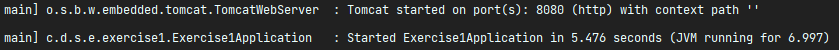
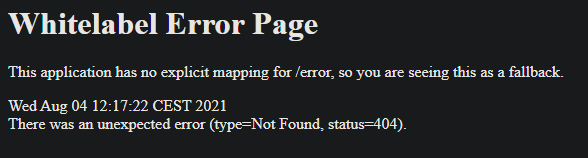
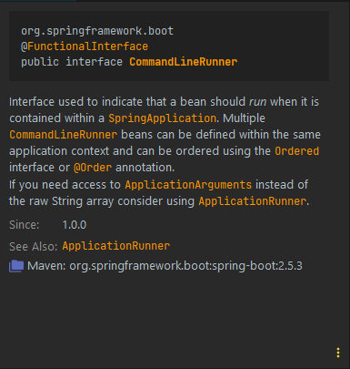
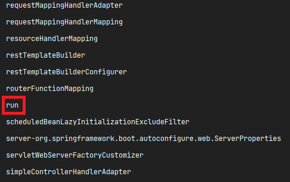
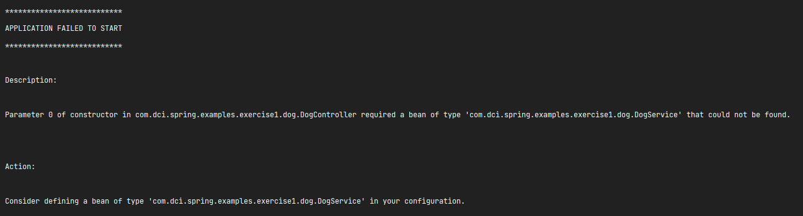
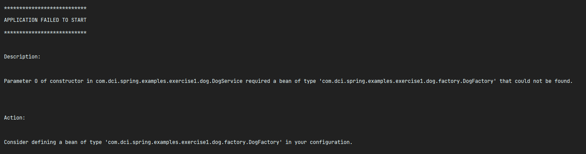
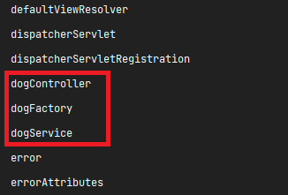
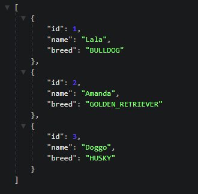

# The IoC container

In this exercise, we'll be creating a few components and inject it in our IoC container, so we can
use them in our application.

Don't worry much about all the annotations used here, as they'll be more detailed taught along this
module. The same applies for the concepts of **Dependency Injection** and **Beans** - you're seeing
them here already, but they'll be further explained later!

## Task 1

The **Exercise1Application** class is our starting point here. That's where you run your Spring Boot
Application.

First and foremost, run it!

You should see on the terminal a similar output:



Meaning the application is up and running on port **8080**. You can just go ahead and check
http://localhost:8080/.

You should get a default error message though:



With a **404 NOT FOUND** error, which means the page was not found. It is expected, as we didn't
configure any controller for that `/` route.

Now, while still at the **Exercise1Application**, you should see the following block of code:

```java
public CommandLineRunner run(ApplicationContext appContext){
    return args->{
    System.out.println();
    System.out.println("============================");
    System.out.println("Printing beans created by the applicationContext");
    System.out.println();

    // gets an array with the name of all beans created in the application context
    String[]beans=appContext.getBeanDefinitionNames();

    // sorts the array alphabetically and prints the name of each on the console
    Arrays.stream(beans).sorted().forEach(System.out::println);
    };
    }
```

As it is, it's just a block of code inside a method that, by itself, is **doing nothing**, as the
method is not being called whatsoever.

Observe that the method returns a **CommandLineRunner**. This is its definition:



So, all in all, the **CommandLineRunner** should be **executed** when put as a bean in the IoC
container.

Go ahead and add the `@Bean` annotation to
the `public CommandLineRunner run(ApplicationContext appContext)` method. Run the application again,
and you should get the output of the
**CommandLineRunner** bean after initializing the application.

Those are **all the beans created by Spring Boot by default** (remember the **convention over
configuration?**).

Among the list of beans, you should also see a bean simply called `run`. It is the bean we just
created of type **CommandLineRunner** (by default, a bean name uses the method name).

`public CommandLineRunner run(ApplicationContext appContext)` -> see that the method is named
`run`? That's the name of this bean.



> **Extra:** Try to change the method's name to something else, and find the new name on the list!

##

## Task 2

Let's move to the next step. We have two packages here: the `config` and the `dog` packages. Our
objective here is to have an endpoint at `/dogs` that retrieves a list of dogs created in our
system.

In the `dog` package, you'll find a couple classes and interfaces.

###

### The entity (domain)

The **Dog** interface is a simple entity interface to represent a Dog. It'll have an ID, a name and
a **Breed**. It has a simple implementation in the `impl` package called `DogImpl`.

The `Breed` is represented by the **Breed** enum, which has multiple breed values.

###

### The presentation layer (controller)

The `DogController` is the class that receives the http request. As of now, the class is not used by
Spring, as it's not annotated with any Spring bean annotation - thus, it's being ignored.

Mark it with the `@RestController` annotation and run your application.

> **Hint**: `@RestController` is an extension of the `@Controller` annotation for REST APIs.


You should get:



If you go back to the `DogController`, you'll see that its constructor expected to have a bean of
type `DogService` injected. As the message clearly says, we don't have that bean in our IoC
container.

###

### The business layer (service)

Going to the `DogService` class, you'll see it has the same previous problem as the controller -
it's being ignored by Spring. Although the class exists, Spring has no way to know if it should
create an instance of this class or not.

Go ahead and mark this class with the `@Service` annotation, and try to run the application.

You should get:



You see your app still fails to run, but it has a different error message now!

By marking the `DogService` with the `@Service` annotation, since the `DogService` is a dependency
of `DogController`, it has to be created first in order to inject it into the
`DogController`. But now, when Spring tries to create a bean of type `DogService`, it complains that
there's no bean of type `DogFactory` in the IoC container, and `DogFactory` is a dependency of
the `DogService`.

This leads us to...

###

### Business beans

The `DogService` has a dependency of type `DogFactory`. Since there's no beans of type
`DogFactory` in the IoC container, we get the above error.

Open the `DogFactory` inside `dog.factory` package. It's a simple factory interface with a single
method. Inside the `impl` package, you'll find its only implementation, `DogFactoryImpl`, which
simply receives the needed parameters and returns an instance of `Dog` - more specifically the
concrete class `DogImpl`.

So far, so good - we now need to have a bean of this class in the application context.

There's different ways to achieve that - but for this exercise, we'll be using the `AppConfig`
class that's inside the `config` package.

Mark this class with the `@Configuration` annotation. You'll learn more about this annotation later,
but basically it tells Spring this class contains configurations for the application.

With that, the class is recognized by Spring, and we can set some app configurations in it!

So you know that we need a bean of type `DogFactory`. Create a method (preferably called
`dogFactory` - it can have any name, but giving logical names is a good practice) that has
`DogFactory` as the return type and returns an instance of `DogFactoryImpl`. **Mark this method with
the `@Bean` annotation!**

Run your application again. If you did everything right, the chain of dependencies of DogFactory >
DogService > DogController should be working fine, and you should now be able to see those beans in
our list of beans in the application context:



###

### Task 3

Everything should be working well now!

The last part of this exercise is: go back to `DogController`. Take a look at the method
`getDogs()`:

```java
@GetMapping("/dogs")
public List<Dog> getDogs(){
    return dogService.getDogs();
    }
```

It has defined a `GET` request to the `/dogs` endpoint. It returns the result of
`dogService.getDogs()` method.

If you now go to the `DogService` and check the `getDogs()` method, you'll see that it's returning
an empty list.

Check it out! In your browser, go to http://localhost:8080/dogs.

You should be getting an empty array as a JSON response. As a last task, populate the list with a
couple instances of the `Dog` class using the `DogFactory` class, which the `DogService` has access
to.

Create a couple instances, bring your application up again and recheck the
http://localhost:8080/dogs endpoint. You should be seeing the instances of dog you created on the
browser.

